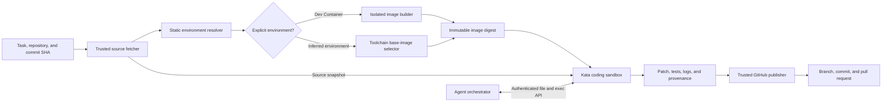

# Cloud Coding Sandbox Environment Reference

## Purpose

This document describes how a cloud coding-agent platform can construct a usable,
isolated development environment when its only initial inputs are:

- a GitHub repository;
- an exact commit or branch;
- a coding task;
- Kubernetes workers using Kata Containers for isolation.

The difficult part is not starting a container. It is discovering and reproducing the
toolchains, dependencies, services, setup steps, and credentials that an arbitrary
repository needs before an agent can edit and validate the code.

This is a design reference, not an implementation plan. It complements
[the coding-agent platform refactor reference](coding-agent-platform-refactor-reference.md),
which covers the broader manager, scheduler, worker, and sandbox abstractions.

## The main recommendation

Do not require every repository to provide a Dockerfile as the platform's permanent
contract.

A Dockerfile is a useful input, but an application or production Dockerfile often does
not provide a suitable development environment. It may use a minimal or distroless final
image, omit Git and test tools, hide build tools in an earlier stage, or say nothing
about setup commands and supporting services.

Use this contract instead:

> A repository with a supported Dev Container configuration receives a deterministic,
> supported environment. A repository without one is attempted through best-effort
> environment inference, with an explicit setup result and failure diagnosis.

Requiring explicit configuration can still be a sensible version-one constraint. If the
first version needs one, prefer `devcontainer.json` over a bare Dockerfile. The Dev
Container model describes a development image or Dockerfile, features, users, workspace
layout, lifecycle commands, environment variables, and supporting containers. These are
the concepts a coding sandbox needs.

The service should distinguish between **supported** and **attempted**, rather than
claiming that every repository can be made runnable. Some projects depend on private
registries, licensed SDKs, unavailable services, special hardware, private datasets, a
particular CPU architecture, or undocumented developer knowledge.

## Separate control, build, execution, and publication

Treat repository contents, dependency installers, build scripts, tests, compiler
plugins, and generated programs as untrusted code. That code should not execute in the
control plane or in the service that holds GitHub write credentials.

The platform is easier to secure when it has four distinct trust zones:

1. **Control plane** — accepts the task, resolves desired state, schedules work, and
   drives the agent.
2. **Environment builder** — executes untrusted Dockerfile and dependency build steps in
   disposable isolation and produces an immutable image or setup result.
3. **Coding sandbox** — exposes only file and process operations over the prepared
   workspace and runs the agent's commands and validation.
4. **Publisher** — receives an exported patch or Git bundle and uses narrowly scoped
   GitHub credentials to create the branch, commit, and pull request.

The model-facing agent process does not need to live inside the sandbox. A useful design
is to run the agent orchestration outside it and place a small execution service inside
the sandbox. The execution service can expose operations such as `exec`, `read`, `write`,
`stat`, and `git diff` over an authenticated connection. Model-provider credentials,
Kubernetes credentials, and GitHub write credentials then remain outside the environment
running repository code.



## Environment resolution ladder

Resolve repository configuration from the most explicit signal to the most speculative.
The resolver should record which signals it used and how confident it is.

| Priority | Repository signal | How to use it |
| --- | --- | --- |
| 1 | `.devcontainer/devcontainer.json` or `.devcontainer.json` | Build the declared development environment using the supported subset of the Dev Container specification |
| 2 | Optional platform configuration | Apply repository-owned setup, service, validation, and resource hints that are not portable Dev Container concepts |
| 3 | CI workflows | Infer runtime versions, service dependencies, installation steps, and validation commands without blindly executing the workflow in the control plane |
| 4 | Toolchain version files | Read files such as `.tool-versions`, `.nvmrc`, `.python-version`, `rust-toolchain.toml`, `go.mod`, and `global.json` |
| 5 | Package manifests and lockfiles | Detect language ecosystems, package managers, package-manager versions, and reproducible install modes |
| 6 | Dockerfile and Compose files | Treat them as evidence, an application image, or supporting services; do not assume the final image is a development environment |
| 7 | Generic toolchain image | Start a broad disposable environment and let setup or the coding agent diagnose and install missing dependencies |
| 8 | Explicit setup failure | Return the attempted plan, command output, missing capabilities, and the configuration needed to make the repository supported |

Repository inspection should initially be static. Cloning a repository is data access;
running its Makefile, package installer, Git hook, lifecycle script, or Dockerfile is code
execution and belongs inside an isolated builder or sandbox.

### The resolved environment plan

The resolver should produce a durable, inspectable plan rather than immediately issuing
ad hoc shell commands. For example:

```yaml
source: inferred
confidence: medium

baseImage: sandbox/python-node@sha256:example

toolchains:
  python: "3.12"
  node: "22"

services:
  - type: postgres
    version: "17"

setup:
  - corepack enable
  - pnpm install --frozen-lockfile

validate:
  - pnpm test
```

The real schema can use structured commands instead of shell strings. The important
properties are provenance, confidence, immutable inputs, and visible reasoning. When
setup fails, the user and agent should be able to tell whether the platform chose the
wrong runtime, lacked a service, encountered a network-policy denial, or found a genuine
repository failure.

Record successful best-effort setup discoveries as suggestions. They can become a
generated environment layer for a retry or a proposed `devcontainer.json`, but the
platform should not silently commit inferred configuration to the user's repository.

## Dev Container support boundary

The Dev Container specification is broader than a first implementation needs to be.
Start with a declared subset:

- `image` or `build.dockerfile`;
- Dev Container Features;
- workspace folder and mount intent;
- container and remote users;
- container and remote environment variables;
- creation and start lifecycle commands;
- a controlled subset of Docker Compose services.

Repository configuration expresses requirements; platform policy decides what is
permitted. Reject or ignore settings that request:

- privileged containers;
- host networking or host process namespaces;
- arbitrary host-path mounts;
- the Docker or containerd socket;
- host devices;
- unbounded resources;
- a weaker isolation runtime than platform policy requires.

Do not silently weaken isolation when the requested configuration cannot run. Return an
unsupported-capability result so the user can decide whether to change the repository,
task, or policy.

## Build phase and execution phase

There are two separate caches and two separate security events.

### Environment build

Building a repository-provided Dockerfile executes arbitrary `RUN` instructions. Run the
build on a disposable, isolated worker with no GitHub write token, model credential, cloud
credential, or Kubernetes API credential. Provide the source as a snapshot rather than
letting an untrusted build fetch it using a reusable repository token.

The builder should output an OCI image by immutable digest. Registry authentication
should be owned by the builder service and not exposed to Dockerfile steps. The resulting
image can be quarantined until policy checks complete.

If a project has no image definition, select a platform-owned base image and perform
dependency installation inside the Kata sandbox. The first run may be slower, but it can
produce a reusable environment layer keyed by the relevant configuration and lockfiles.

### Coding and validation

The coding sandbox starts from the selected image digest, attaches a writable workspace,
and runs setup, agent commands, and validation in that same workspace. It should be legal
for the sandbox user to change the workspace and install task-local dependencies, but not
to mutate the worker host or other sandboxes.

Root inside a Kata guest may be an acceptable compatibility choice for some platform
profiles, but it must not imply Kubernetes privilege, host capabilities, host mounts, or
access to the container runtime. A non-root default with an explicit in-guest package
installation mechanism is easier to reason about.

## Kubernetes and Kata sandbox shape

A simple ownership model is one ephemeral namespace per coding run. The namespace can
contain:

- the main Kata sandbox pod;
- controller-created database or service pods;
- a writable workspace volume;
- ResourceQuota and LimitRange policies;
- default-deny ingress and egress policies;
- a cleanup deadline and ownership labels.

Kubernetes selects Kata through a `RuntimeClass`. Configure scheduling so Kata pods land
only on workers with the correct runtime and hardware virtualization, and declare runtime
overhead so the scheduler accounts for the guest VM's additional resources.

A baseline sandbox pod should have properties resembling:

```yaml
spec:
  runtimeClassName: kata
  automountServiceAccountToken: false
  hostNetwork: false
  hostPID: false
  hostIPC: false
  containers:
    - name: runner
      securityContext:
        privileged: false
        allowPrivilegeEscalation: false
        capabilities:
          drop: ["ALL"]
      resources:
        requests:
          cpu: "2"
          memory: 4Gi
        limits:
          cpu: "4"
          memory: 8Gi
```

The concrete platform should additionally enforce:

- CPU, memory, ephemeral-storage, persistent-storage, process-count, and wall-time limits;
- no service-account token or Kubernetes API access;
- no host paths, runtime socket, privileged mode, or host namespaces;
- a runtime-default or stricter seccomp profile;
- no access to cloud instance-metadata and worker-management endpoints;
- no ingress except from the authenticated execution gateway;
- an egress policy implemented by a CNI that actually enforces NetworkPolicy;
- immutable base-image references;
- deletion of the namespace, VM, volume, and per-run secrets after artifact export.

Kata strengthens the host boundary by placing the workload behind a guest kernel. It
does not replace network policy, credential scoping, resource control, artifact review,
or cleanup. Containers in the same pod also share a sandbox boundary, so do not place a
secret-holding trusted publisher beside untrusted code merely because the pod uses Kata.

## Network and dependency access

Arbitrary dependency installation needs substantial internet access. Arbitrary egress
also enables credential exfiltration, scanning, spam, cryptomining coordination, and
other abuse. Divide networking into phases:

| Phase | Suggested access |
| --- | --- |
| Source fetch | Trusted fetcher contacts GitHub and produces an exact-SHA snapshot |
| Image build and setup | Sandbox reaches approved package registries through a caching and auditing proxy |
| Coding and tests | Default-deny with task- or policy-approved destinations |
| Publication | Only the trusted publisher contacts GitHub with write authority |

Vanilla NetworkPolicy controls addresses and ports, not repository-level intent or HTTP
paths. A controlled egress proxy or gateway is needed for domain-aware allowlists,
auditing, rate limits, and blocking instance-metadata destinations. Default-deny egress
must explicitly allow cluster DNS if DNS resolution is required.

Private dependencies should be modeled as declared capabilities. Deliver short-lived,
registry-specific credentials only to the phase that needs them. Avoid shared writable
package caches between tenants; prefer a read-through artifact proxy or immutable,
content-addressed cache to reduce cache-poisoning risk.

## GitHub credentials and pull-request publication

Do not give the coding sandbox a token capable of pushing a branch or opening a pull
request.

A trusted source service can use a short-lived, repository-scoped read credential and
then pass a source snapshot into the sandbox. At completion, the sandbox exports:

- a patch or Git bundle;
- the base commit SHA;
- changed-file and file-size metadata;
- validation commands and results;
- the resolved environment plan and image digests;
- relevant logs and resource-usage records.

The trusted publisher validates the export and uses a GitHub App installation token to
create the branch, commit, and pull request. The publisher can require additional
approval when changes affect security-sensitive paths such as:

- `.github/workflows/**`;
- Dev Container, Docker, or build configuration;
- package-manager install hooks;
- executable scripts;
- deployment and infrastructure definitions.

Sensitive paths should not be universally forbidden because modifying them may be the
task. They should receive stronger review and policy treatment.

## Caching and cold-start strategy

Do not begin with one enormous image containing every language and every version. A
useful progression is:

1. Maintain a small generic image with Git, shell tools, certificates, and common build
   prerequisites.
2. Add ecosystem images for common families such as Node, Python, JVM, Go, Rust, and
   .NET.
3. Select an image from static repository signals.
4. Cache immutable Dev Container builds and dependency downloads.
5. Prebuild frequently used default-branch environments when their environment
   configuration changes.

An environment cache key should include the base image digest, Dev Container or
Dockerfile content, enabled features, platform policy version, CPU architecture, and any
files that affect toolchain or dependency setup. If the Docker build context copies the
whole repository, normal content-addressed build caching must also account for that
content rather than relying on a hand-written partial key.

Keep source workspaces per run unless the runs are part of an explicitly trusted reuse
model. Reusing a writable workspace or dependency directory across unrelated repositories
creates data-leakage and cache-poisoning risks.

## Setup and failure semantics

Environment preparation is an observable lifecycle, not a hidden prelude to the agent.
A useful state model is:

`Inspecting → Planning → Building → Provisioning → SettingUp → Ready`

Terminal setup outcomes can include:

- `InvalidConfiguration` — an explicit environment file is malformed;
- `PolicyDenied` — the repository requests a forbidden capability;
- `UnsupportedCapability` — no worker or sandbox profile can meet the requirement;
- `BuildFailed` — image construction failed;
- `DependencyFailed` — package or toolchain setup failed;
- `NetworkDenied` — required access was blocked by policy;
- `TimedOut` or `ResourceExceeded`;
- `Ready` — the agent can begin coding.

Do not collapse all of these into “agent failed.” A failed validation command after the
agent edits code is also different from a failed sandbox or failed environment setup.

Each phase needs bounded retries and deadlines. Retry infrastructure failures that are
plausibly transient, but do not repeatedly execute deterministic repository scripts
without surfacing their failure. Always retain enough evidence to diagnose the last
attempt, then perform cleanup even when artifact export or publication fails.

## A practical first version

Use three published support tiers:

1. **Supported** — a repository contains a `devcontainer.json` using the implemented
   subset.
2. **Best effort** — a recognized Node, Python, Go, Rust, Java, or .NET repository has
   toolchain files and lockfiles the resolver understands.
3. **Needs configuration** — setup fails with a report and a request for a Dev Container
   configuration or declared capability.

The first end-to-end milestone can be limited to:

- one GitHub App and trusted source/publisher service;
- one Linux worker pool configured with Kata;
- one environment-builder path;
- a supported subset of the Dev Container specification;
- two or three inferred language ecosystems;
- a per-run workspace and namespace;
- streamed command output, cancellation, deadlines, and resource limits;
- patch export followed by trusted PR publication;
- reliable revocation and deletion.

This boundary is intentionally smaller than “run every GitHub repository.” It tests the
important architecture without hiding unsupported cases behind unreliable heuristics.

## Measurements worth keeping

Track environment behavior separately from agent behavior:

- static inspection and planning duration;
- Dev Container or Dockerfile build duration and cache-hit rate;
- sandbox and service startup time;
- dependency setup duration and download volume;
- resolution source and confidence;
- setup failures grouped by terminal reason;
- agent execution and validation duration;
- CPU, memory, disk, process, and network usage per run;
- exported patch size and changed-file count;
- publication failures;
- expired credentials and leaked resources found during reconciliation.

These measurements show whether the next useful optimization is better inference, more
prebuilds, a different base-image split, faster Kata startup, or clearer repository
configuration.

## Questions to revisit

- Which Dev Container properties are supported, rejected, or ignored?
- Is the optional platform configuration necessary, or can standard Dev Container
  metadata cover the supported use cases?
- Can an agent propose and retry an environment-plan change during the same run?
- Which package registries are allowed by default?
- How are private dependency credentials requested and approved?
- Are service containers trusted platform images, repository-built images, or both?
- Which files or changes require additional approval before publication?
- Is root inside the Kata guest allowed for all jobs or only compatibility profiles?
- Which state survives a lost worker or failed publisher?
- When is environment reuse safe, and which cache inputs prove equivalence?
- How does the platform explain that an inferred environment is best effort rather than
  reproducible?

## Further reading

- [Development Container Specification](https://github.com/devcontainers/spec/blob/main/docs/specs/devcontainer-reference.md) — metadata, users, workspace handling, lifecycle commands, and multi-container development environments.
- [GitHub Codespaces: What are codespaces?](https://docs.github.com/en/codespaces/about-codespaces/what-are-codespaces) — an example of explicit Dev Container configuration with a broad default-image fallback.
- [GitHub: Introduction to dev containers](https://docs.github.com/en/codespaces/setting-up-your-project-for-codespaces/adding-a-dev-container-configuration/introduction-to-dev-containers) — repository layout and the relationship among `devcontainer.json`, images, Dockerfiles, and Compose.
- [Kubernetes RuntimeClass](https://kubernetes.io/docs/concepts/containers/runtime-class/) — runtime selection, scheduling constraints, and pod-overhead accounting.
- [Kubernetes Network Policies](https://kubernetes.io/docs/concepts/services-networking/network-policies/) — default traffic behavior and default-deny ingress and egress policies.
- [Kubernetes Service Accounts](https://kubernetes.io/docs/concepts/security/service-accounts/) — disabling automatic API-token injection and using short-lived credentials.
- [Kubernetes LimitRange](https://kubernetes.io/docs/concepts/policy/limit-range/) and [ResourceQuota](https://kubernetes.io/docs/concepts/policy/resource-quotas/) — per-object and per-namespace resource constraints.
- [GitHub App installation access tokens](https://docs.github.com/en/authentication/connecting-to-github-with-ssh/managing-deploy-keys#github-app-installation-access-tokens) — repository-scoped, fine-grained, expiring credentials for trusted source and publisher services.
